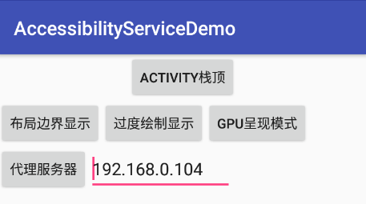

# AccessibilityServiceDemo
开发工具辅助及栈顶悬浮框

# 下载
[demo.apk](app/build/outputs/apk/app-debug.apk)

# 开发工具辅助

 

**布局边界显示**
 AccessibilityService会自己滚动到setting的开发者选项页面里找到布局边界显示项并自动触发<b>
**过度绘制显示**
 AccessibilityService会自己滚动到setting的开发者选项页面里找到布局边界显示项并自动触发,在弹出的选择框中自动选择关闭和显示过度绘制 
**GPU呈现模式**
 AccessibilityService会自己滚动到setting的开发者选项页面里找到布局边界显示项并自动触发,在弹出的选择框中自动选择关闭和显示条形 

# 栈顶class显示
AccessibilityService会监听window_state_change时当前包名和栈顶类显示 
